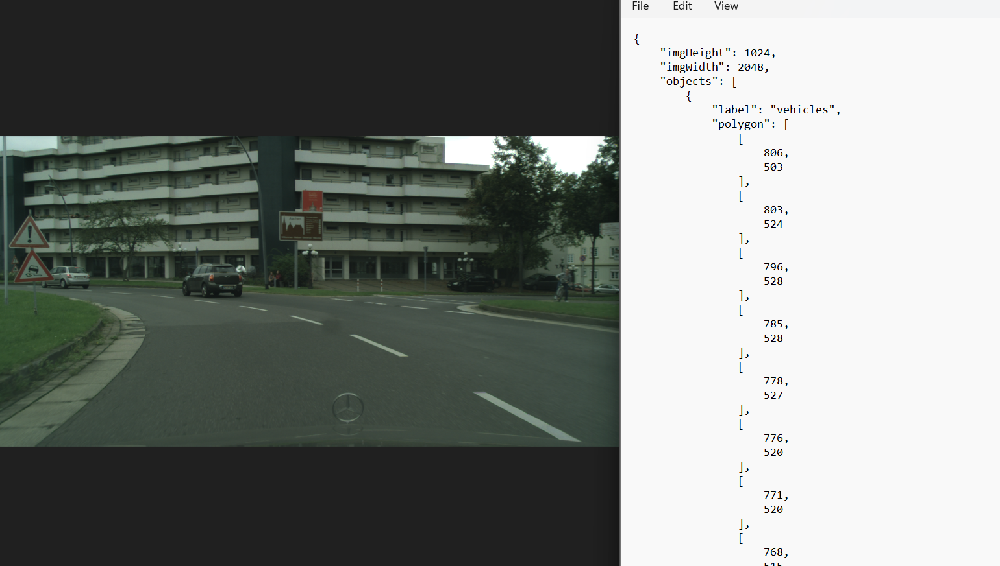
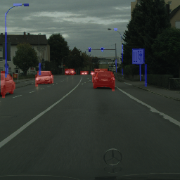
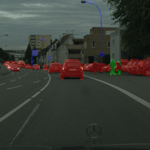
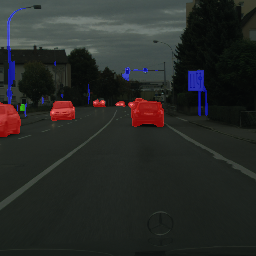
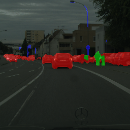
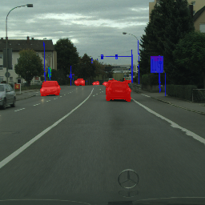
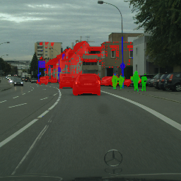

# Vehicle_Human_Object_Segmentation

# Vehicle, Human, and Static Object Segmentation in Urban Areas

This project focuses on the segmentation of vehicles, humans, and static objects in urban areas of the city. The dataset used includes annotations of the following type:

- **Dataset Example with Annotation**:

  

## Methodology

Each folder contains scripts that generate masks or annotations in the required format for various models. The following are examples of format requirements:

- **YOLO v11 Segmentation**: Requires a `.txt` file containing points.
- **U-Net and SAM**: Require masks generated for each class.

**Note**: Certain models require images to be resized. For instance, YOLO requires input images to be 640 pixels.

## Results

The results for each model are shown in the following figures:

- **YOLO Results**:

  

    
    
  

- **U-Net Results**:

  

    
    
  

- **SAM Results**:

  

    
    
  

